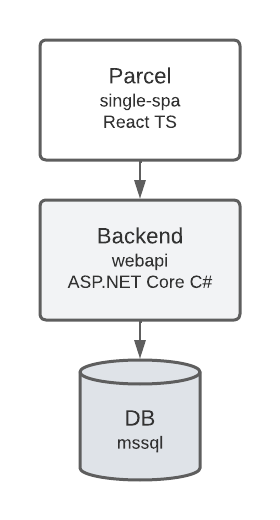
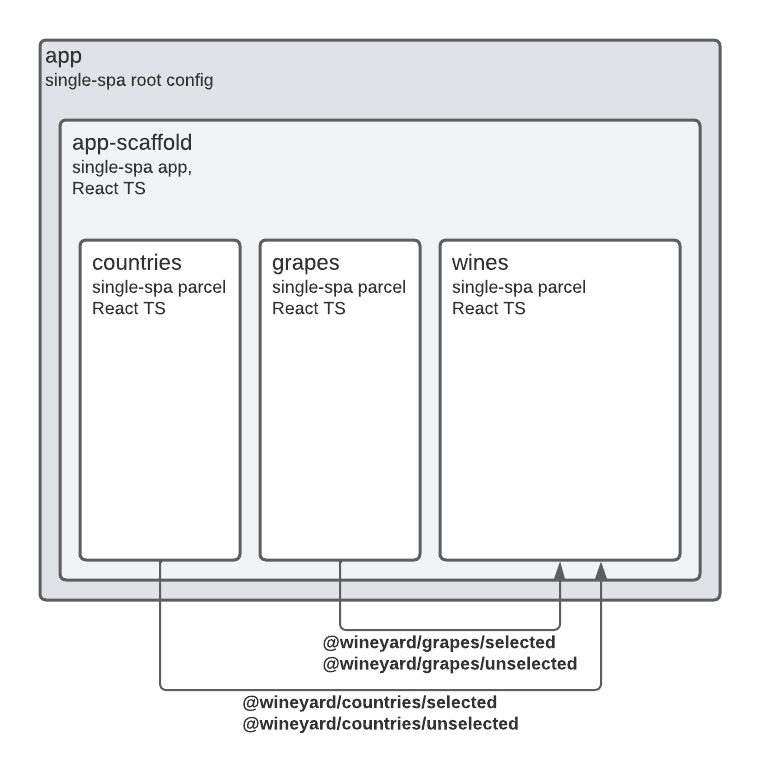

# Wineyard

This repo I'll use to exercise some ideas, practices and findings in a way of working distributed software.  
It's has Single-SPA React based microfrontend consuming, by each Parcel, an REST API made from ASP.NET Core. 
The overall architecture from each Parcel is:

There's 3 Parcels embeded on an App and they shares data via Custom events as shown on diagram:

